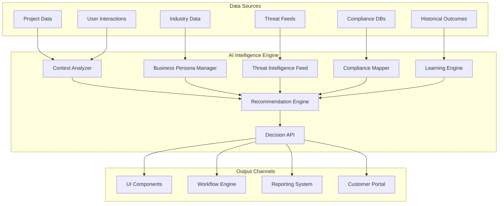

# AI Intelligence Engine - Technical Implementation Specification

## Overview
The AI Intelligence Engine is the core brain of the platform that provides context-aware recommendations, automated decision-making, and intelligent workflow orchestration. This document outlines the technical implementation for Phase 1 of the strategic roadmap.

---

## 🧠 Architecture Overview



---

## 🔧 Core Components

### 1. Context Analyzer
**Purpose**: Analyzes current project context to understand the situation and requirements.

```typescript
interface ProjectContext {
  // Organization Context
  organization: {
    industry: string;
    subIndustry?: string;
    size: OrganizationSize;
    type: 'public' | 'private' | 'non-profit' | 'government';
    locations: GeographicLocation[];
    complianceRequirements: ComplianceFramework[];
  };

  // Technical Context
  technical: {
    existingVendors: ExistingVendor[];
    networkArchitecture: NetworkTopology;
    securityPosture: SecurityAssessment;
    deviceInventory: DeviceInventory;
    currentPainPoints: PainPoint[];
  };

  // Business Context
  business: {
    budget: BudgetConstraints;
    timeline: TimelineRequirements;
    stakeholders: BusinessStakeholder[];
    successCriteria: SuccessMetric[];
    riskTolerance: RiskProfile;
  };

  // Project Context
  project: {
    phase: ProjectPhase;
    requirements: Requirement[];
    selectedUseCases: UseCase[];
    constraints: ProjectConstraint[];
    history: ProjectHistory[];
  };
}

class ContextAnalyzer {
  async analyzeContext(projectId: string): Promise<ProjectContext> {
    // Gather data from multiple sources
    const projectData = await this.getProjectData(projectId);
    const organizationData = await this.getOrganizationData(projectData.clientId);
    const technicalData = await this.getTechnicalAssessment(projectId);
    const businessData = await this.getBusinessRequirements(projectId);

    // Enrich with external data
    const industryData = await this.getIndustryInsights(organizationData.industry);
    const threatData = await this.getCurrentThreats(organizationData);
    const complianceData = await this.getComplianceRequirements(organizationData);

    return this.synthesizeContext({
      projectData,
      organizationData,
      technicalData,
      businessData,
      industryData,
      threatData,
      complianceData
    });
  }

  private async enrichWithAI(context: Partial<ProjectContext>): Promise<ProjectContext> {
    // Use AI to fill gaps and make inferences
    const prompt = this.buildContextAnalysisPrompt(context);
    const aiInsights = await this.aiService.generateCompletion({
      prompt,
      temperature: 0.3,
      maxTokens: 2000
    });

    return this.mergeAIInsights(context, aiInsights);
  }
}
```

### 2. Business Persona Manager
**Purpose**: Manages industry-specific business personas and maps organizations to appropriate profiles.

```typescript
interface BusinessPersona {
  id: string;
  name: string;
  industry: string;
  subIndustries: string[];
  
  // Characteristics
  organizationSizes: OrganizationSize[];
  commonPainPoints: PainPointTemplate[];
  typicalVendors: VendorPreference[];
  budgetProfiles: BudgetProfile[];
  timelineExpectations: TimelineProfile[];
  
  // Security & Compliance
  securityPosture: SecurityPostureTemplate;
  complianceFrameworks: ComplianceFramework[];
  commonThreats: ThreatProfile[];
  
  // Technical Patterns
  networkPatterns: NetworkTopologyPattern[];
  deviceTypes: DeviceTypePattern[];
  integrationPatterns: IntegrationPattern[];
  
  // Success Patterns
  successMetrics: KPITemplate[];
  criticalSuccessFactors: SuccessFactor[];
  commonFailurePoints: FailurePattern[];
}

class BusinessPersonaManager {
  private personas: Map<string, BusinessPersona> = new Map();

  async matchPersona(organizationData: OrganizationData): Promise<PersonaMatch> {
    const matches = await this.findMatches(organizationData);
    const bestMatch = this.selectBestMatch(matches);
    
    // Use AI to refine the match
    const refinedMatch = await this.refineWithAI(bestMatch, organizationData);
    
    return {
      persona: refinedMatch.persona,
      confidence: refinedMatch.confidence,
      customizations: refinedMatch.customizations,
      reasoning: refinedMatch.reasoning
    };
  }

  async createCustomPersona(organizationData: OrganizationData): Promise<BusinessPersona> {
    // AI-powered persona creation for unique organizations
    const prompt = this.buildPersonaCreationPrompt(organizationData);
    const aiPersona = await this.aiService.generateCompletion({
      prompt,
      temperature: 0.4,
      maxTokens: 3000
    });

    const persona = this.parseAIPersona(aiPersona);
    await this.validatePersona(persona);
    
    return persona;
  }
}
```

### 3. Recommendation Engine
**Purpose**: Generates intelligent recommendations based on context analysis and business personas.

```typescript
interface RecommendationRequest {
  context: ProjectContext;
  persona: BusinessPersona;
  requestType: RecommendationType;
  constraints?: RecommendationConstraint[];
}

interface Recommendation {
  id: string;
  type: RecommendationType;
  title: string;
  description: string;
  confidence: number; // 0-1
  priority: 'critical' | 'high' | 'medium' | 'low';
  
  // Evidence & Reasoning
  reasoning: string;
  evidence: Evidence[];
  alternatives: Alternative[];
  
  // Impact Assessment
  impact: {
    business: BusinessImpact;
    technical: TechnicalImpact;
    financial: FinancialImpact;
    timeline: TimelineImpact;
    risk: RiskImpact;
  };
  
  // Implementation
  implementationSteps: ImplementationStep[];
  prerequisites: Prerequisite[];
  dependencies: Dependency[];
  
  // Metadata
  sources: DataSource[];
  lastUpdated: Date;
  validUntil?: Date;
}

class RecommendationEngine {
  async generateRecommendations(request: RecommendationRequest): Promise<Recommendation[]> {
    const recommendations: Recommendation[] = [];

    // Generate different types of recommendations
    recommendations.push(...await this.generateVendorRecommendations(request));
    recommendations.push(...await this.generateUseCaseRecommendations(request));
    recommendations.push(...await this.generateConfigurationRecommendations(request));
    recommendations.push(...await this.generateTimelineRecommendations(request));
    recommendations.push(...await this.generateRiskMitigationRecommendations(request));

    // Score and rank recommendations
    const scoredRecommendations = await this.scoreRecommendations(recommendations, request);
    
    // Use AI to refine and optimize
    const optimizedRecommendations = await this.optimizeWithAI(scoredRecommendations, request);

    return this.rankRecommendations(optimizedRecommendations);
  }

  private async generateVendorRecommendations(request: RecommendationRequest): Promise<Recommendation[]> {
    const { context, persona } = request;
    const recommendations: Recommendation[] = [];

    // Analyze current vendor landscape
    const vendorGaps = await this.analyzeVendorGaps(context.technical.existingVendors, persona.typicalVendors);
    
    // Generate recommendations for each gap
    for (const gap of vendorGaps) {
      const suitableVendors = await this.findSuitableVendors(gap, context);
      
      for (const vendor of suitableVendors) {
        const recommendation = await this.buildVendorRecommendation(vendor, gap, context);
        recommendations.push(recommendation);
      }
    }

    return recommendations;
  }

  private async optimizeWithAI(recommendations: Recommendation[], request: RecommendationRequest): Promise<Recommendation[]> {
    const prompt = this.buildOptimizationPrompt(recommendations, request);
    
    const aiOptimization = await this.aiService.generateCompletion({
      prompt,
      temperature: 0.2,
      maxTokens: 4000
    });

    return this.applyAIOptimizations(recommendations, aiOptimization);
  }
}
```

### 4. Threat Intelligence Integration
**Purpose**: Integrates real-time threat intelligence to inform security recommendations.

```typescript
interface ThreatIntelligence {
  id: string;
  title: string;
  description: string;
  severity: 'critical' | 'high' | 'medium' | 'low';
  type: ThreatType;
  
  // Targeting
  targetIndustries: string[];
  targetOrganizationSizes: OrganizationSize[];
  targetTechnologies: string[];
  targetGeographies: string[];
  
  // Technical Details
  attackVectors: AttackVector[];
  affectedVendors: string[];
  mitigationStrategies: MitigationStrategy[];
  
  // Intelligence
  source: ThreatSource;
  confidence: number;
  firstSeen: Date;
  lastUpdated: Date;
  expiryDate?: Date;
}

class ThreatIntelligenceService {
  private feeds: ThreatFeed[] = [];

  async getRelevantThreats(context: ProjectContext): Promise<ThreatIntelligence[]> {
    const threats = await this.aggregateThreats();
    
    // Filter by relevance
    const relevantThreats = threats.filter(threat => 
      this.isRelevantToContext(threat, context)
    );

    // Score by relevance and recency
    const scoredThreats = relevantThreats.map(threat => ({
      ...threat,
      relevanceScore: this.calculateRelevanceScore(threat, context)
    }));

    return scoredThreats
      .sort((a, b) => b.relevanceScore - a.relevanceScore)
      .slice(0, 20); // Top 20 most relevant threats
  }

  async generateThreatBasedRecommendations(threats: ThreatIntelligence[], context: ProjectContext): Promise<Recommendation[]> {
    const recommendations: Recommendation[] = [];

    for (const threat of threats) {
      // Generate specific recommendations to mitigate this threat
      const mitigationRecommendations = await this.generateMitigationRecommendations(threat, context);
      recommendations.push(...mitigationRecommendations);
    }

    return recommendations;
  }

  private async aggregateThreats(): Promise<ThreatIntelligence[]> {
    const threats: ThreatIntelligence[] = [];

    // Aggregate from multiple sources
    for (const feed of this.feeds) {
      const feedThreats = await feed.getLatestThreats();
      threats.push(...feedThreats);
    }

    // Deduplicate and normalize
    return this.deduplicateThreats(threats);
  }
}
```

### 5. Learning Engine
**Purpose**: Continuously learns from user interactions and project outcomes to improve recommendations.

```typescript
interface LearningEvent {
  id: string;
  type: LearningEventType;
  timestamp: Date;
  userId: string;
  projectId: string;
  
  // Event Data
  recommendation?: Recommendation;
  userAction: UserAction;
  outcome?: ProjectOutcome;
  feedback?: UserFeedback;
  
  // Context
  context: ProjectContext;
  sessionId: string;
}

interface LearningModel {
  id: string;
  name: string;
  version: string;
  type: ModelType;
  
  // Model Data
  features: ModelFeature[];
  weights: ModelWeights;
  performance: ModelPerformance;
  
  // Metadata
  trainedOn: Date;
  lastUpdated: Date;
  trainingDataSize: number;
}

class LearningEngine {
  private models: Map<string, LearningModel> = new Map();

  async recordEvent(event: LearningEvent): Promise<void> {
    // Store the event
    await this.storeEvent(event);
    
    // Update models if necessary
    if (this.shouldUpdateModels(event)) {
      await this.updateModels(event);
    }
  }

  async improveRecommendations(recommendations: Recommendation[], context: ProjectContext): Promise<Recommendation[]> {
    // Apply learned improvements
    const improvedRecommendations = await Promise.all(
      recommendations.map(rec => this.applyLearnings(rec, context))
    );

    return improvedRecommendations;
  }

  private async updateModels(event: LearningEvent): Promise<void> {
    // Identify which models need updating
    const modelsToUpdate = this.identifyModelsForUpdate(event);

    for (const modelId of modelsToUpdate) {
      await this.retrainModel(modelId, event);
    }
  }

  private async retrainModel(modelId: string, event: LearningEvent): Promise<void> {
    const model = this.models.get(modelId);
    if (!model) return;

    // Get recent training data
    const trainingData = await this.getTrainingData(modelId, 1000);
    trainingData.push(event);

    // Retrain the model
    const updatedModel = await this.trainModel(model, trainingData);
    
    // Validate performance
    const performance = await this.validateModel(updatedModel);
    
    if (performance.accuracy > model.performance.accuracy) {
      // Deploy the improved model
      this.models.set(modelId, updatedModel);
      await this.saveModel(updatedModel);
    }
  }
}
```

---

## 🔌 API Design

### RESTful API Endpoints

```typescript
// Context Analysis
GET    /api/v1/context/{projectId}
POST   /api/v1/context/{projectId}/analyze

// Business Personas
GET    /api/v1/personas
GET    /api/v1/personas/{personaId}
POST   /api/v1/personas/match
POST   /api/v1/personas/custom

// Recommendations
POST   /api/v1/recommendations/generate
GET    /api/v1/recommendations/{recommendationId}
POST   /api/v1/recommendations/{recommendationId}/feedback
PUT    /api/v1/recommendations/{recommendationId}/status

// Threat Intelligence
GET    /api/v1/threats/relevant/{projectId}
GET    /api/v1/threats/feeds
POST   /api/v1/threats/feeds

// Learning
POST   /api/v1/learning/events
GET    /api/v1/learning/models
POST   /api/v1/learning/models/{modelId}/retrain
```

### WebSocket Events

```typescript
// Real-time recommendation updates
interface RecommendationUpdate {
  type: 'recommendation_generated' | 'recommendation_updated' | 'threat_detected';
  projectId: string;
  data: any;
}

// Learning events
interface LearningUpdate {
  type: 'model_updated' | 'accuracy_improved' | 'new_pattern_detected';
  modelId: string;
  data: any;
}
```

---

## 🗄️ Database Schema

```sql
-- Business Personas
CREATE TABLE business_personas (
  id UUID PRIMARY KEY DEFAULT gen_random_uuid(),
  name TEXT NOT NULL,
  industry TEXT NOT NULL,
  sub_industries TEXT[],
  organization_sizes TEXT[],
  common_pain_points JSONB,
  typical_vendors JSONB,
  budget_profiles JSONB,
  timeline_expectations JSONB,
  security_posture JSONB,
  compliance_frameworks TEXT[],
  common_threats JSONB,
  network_patterns JSONB,
  device_types JSONB,
  integration_patterns JSONB,
  success_metrics JSONB,
  critical_success_factors JSONB,
  common_failure_points JSONB,
  created_at TIMESTAMP DEFAULT NOW(),
  updated_at TIMESTAMP DEFAULT NOW()
);

-- Project Context
CREATE TABLE project_contexts (
  id UUID PRIMARY KEY DEFAULT gen_random_uuid(),
  project_id UUID REFERENCES projects(id),
  organization_context JSONB NOT NULL,
  technical_context JSONB NOT NULL,
  business_context JSONB NOT NULL,
  project_context JSONB NOT NULL,
  matched_persona_id UUID REFERENCES business_personas(id),
  persona_confidence DECIMAL(3,2),
  context_score DECIMAL(3,2),
  last_analyzed TIMESTAMP DEFAULT NOW(),
  created_at TIMESTAMP DEFAULT NOW(),
  updated_at TIMESTAMP DEFAULT NOW()
);

-- Recommendations
CREATE TABLE ai_recommendations (
  id UUID PRIMARY KEY DEFAULT gen_random_uuid(),
  project_id UUID REFERENCES projects(id),
  context_id UUID REFERENCES project_contexts(id),
  type TEXT NOT NULL CHECK (type IN ('vendor', 'use_case', 'configuration', 'timeline', 'risk_mitigation')),
  title TEXT NOT NULL,
  description TEXT NOT NULL,
  confidence DECIMAL(3,2) NOT NULL CHECK (confidence >= 0 AND confidence <= 1),
  priority TEXT NOT NULL CHECK (priority IN ('critical', 'high', 'medium', 'low')),
  reasoning TEXT NOT NULL,
  evidence JSONB,
  alternatives JSONB,
  impact_assessment JSONB,
  implementation_steps JSONB,
  prerequisites JSONB,
  dependencies JSONB,
  sources JSONB,
  status TEXT DEFAULT 'pending' CHECK (status IN ('pending', 'accepted', 'rejected', 'implemented')),
  user_feedback JSONB,
  valid_until TIMESTAMP,
  created_at TIMESTAMP DEFAULT NOW(),
  updated_at TIMESTAMP DEFAULT NOW()
);

-- Threat Intelligence
CREATE TABLE threat_intelligence (
  id UUID PRIMARY KEY DEFAULT gen_random_uuid(),
  title TEXT NOT NULL,
  description TEXT NOT NULL,
  severity TEXT NOT NULL CHECK (severity IN ('critical', 'high', 'medium', 'low')),
  type TEXT NOT NULL,
  target_industries TEXT[],
  target_organization_sizes TEXT[],
  target_technologies TEXT[],
  target_geographies TEXT[],
  attack_vectors JSONB,
  affected_vendors TEXT[],
  mitigation_strategies JSONB,
  source TEXT NOT NULL,
  confidence DECIMAL(3,2) NOT NULL,
  first_seen TIMESTAMP NOT NULL,
  expiry_date TIMESTAMP,
  created_at TIMESTAMP DEFAULT NOW(),
  updated_at TIMESTAMP DEFAULT NOW()
);

-- Learning Events
CREATE TABLE learning_events (
  id UUID PRIMARY KEY DEFAULT gen_random_uuid(),
  type TEXT NOT NULL,
  user_id UUID REFERENCES auth.users(id),
  project_id UUID REFERENCES projects(id),
  recommendation_id UUID REFERENCES ai_recommendations(id),
  user_action JSONB NOT NULL,
  outcome JSONB,
  feedback JSONB,
  context JSONB NOT NULL,
  session_id TEXT,
  created_at TIMESTAMP DEFAULT NOW()
);

-- Learning Models
CREATE TABLE learning_models (
  id UUID PRIMARY KEY DEFAULT gen_random_uuid(),
  name TEXT NOT NULL,
  version TEXT NOT NULL,
  type TEXT NOT NULL,
  features JSONB,
  weights JSONB,
  performance JSONB,
  trained_on TIMESTAMP,
  training_data_size INTEGER,
  is_active BOOLEAN DEFAULT FALSE,
  created_at TIMESTAMP DEFAULT NOW(),
  updated_at TIMESTAMP DEFAULT NOW()
);

-- Indexes for performance
CREATE INDEX idx_project_contexts_project_id ON project_contexts(project_id);
CREATE INDEX idx_ai_recommendations_project_id ON ai_recommendations(project_id);
CREATE INDEX idx_ai_recommendations_type ON ai_recommendations(type);
CREATE INDEX idx_ai_recommendations_priority ON ai_recommendations(priority);
CREATE INDEX idx_threat_intelligence_industries ON threat_intelligence USING GIN(target_industries);
CREATE INDEX idx_threat_intelligence_severity ON threat_intelligence(severity);
CREATE INDEX idx_learning_events_project_id ON learning_events(project_id);
CREATE INDEX idx_learning_events_type ON learning_events(type);
```

---

## 🧪 Implementation Plan

### Week 1: Foundation & Context Analyzer
- [ ] Set up AI service integration (OpenAI/custom models)
- [ ] Implement basic Context Analyzer
- [ ] Create database schema and migrations
- [ ] Build context analysis API endpoints
- [ ] Unit tests for context analysis

### Week 2: Business Persona System
- [ ] Design and implement BusinessPersonaManager
- [ ] Create initial set of industry personas (10+ industries)
- [ ] Implement persona matching algorithm
- [ ] Build persona management UI components
- [ ] Integration tests for persona matching

### Week 3: Recommendation Engine Core
- [ ] Implement RecommendationEngine framework
- [ ] Build vendor recommendation logic
- [ ] Implement use case recommendation logic
- [ ] Create recommendation scoring system
- [ ] API endpoints for recommendations

### Week 4: Threat Intelligence & Learning
- [ ] Implement ThreatIntelligenceService
- [ ] Set up threat feed integrations
- [ ] Build basic LearningEngine
- [ ] Implement feedback collection
- [ ] End-to-end testing

### Testing Strategy
- **Unit Tests**: 90%+ coverage for all AI components
- **Integration Tests**: API endpoint testing with real data
- **Performance Tests**: Load testing with 1000+ concurrent users
- **AI Model Tests**: Accuracy and confidence testing with validation datasets
- **Security Tests**: Input validation and data protection testing

---

## 📊 Success Metrics

### Technical Metrics
- **Recommendation Accuracy**: >85% user acceptance rate
- **Context Analysis Speed**: <2 seconds for complete analysis
- **API Response Time**: <500ms for recommendation generation
- **Model Performance**: >80% accuracy in prediction tasks
- **System Uptime**: 99.9% availability

### Business Metrics
- **User Engagement**: 70%+ of users actively using AI recommendations
- **Decision Speed**: 40% reduction in decision-making time
- **Project Success Rate**: 25% improvement in successful project outcomes
- **Customer Satisfaction**: 90%+ satisfaction with AI-powered insights
- **Revenue Impact**: 20% increase in deal closure rates

---

This AI Intelligence Engine will serve as the foundation for all intelligent features in the platform, providing context-aware recommendations that continuously improve through machine learning. The modular design allows for easy extension and integration with other platform components.

Next steps: Would you like me to proceed with implementing the Context Analyzer component, or would you prefer to review and refine this specification first?
