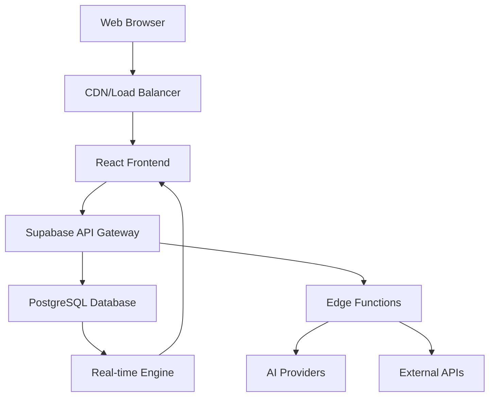

# Product Requirements Document (PRD)
## NAC Solution Platform v2.1

### Document Information
- **Version**: 2.1.0
- **Date**: 2025-01-25
- **Status**: Active Development
- **Owner**: Product Management Team
- **Stakeholders**: Engineering, Sales, Customer Success, Security

---

## 1. Executive Summary

### 1.1 Product Vision
The NAC Solution Platform is an enterprise-grade, AI-powered Network Access Control solution designed to revolutionize how organizations implement, manage, and maintain network security across multi-vendor environments.

### 1.2 Business Objectives
- **Primary**: Reduce NAC implementation time by 70% through AI-powered automation
- **Secondary**: Increase customer satisfaction with real-time project visibility
- **Tertiary**: Capture 25% market share in enterprise NAC consulting within 18 months

### 1.3 Success Metrics
- **User Adoption**: 500+ active enterprise customers within 12 months
- **Implementation Speed**: Average project timeline reduction from 6 months to 2 months
- **Customer Satisfaction**: NPS score > 50
- **Revenue Growth**: $10M ARR within 18 months

---

## 2. Market Analysis

### 2.1 Target Market
- **Primary**: Enterprise organizations (1000+ employees) implementing NAC solutions
- **Secondary**: Managed Service Providers (MSPs) offering NAC services
- **Tertiary**: Network consulting firms specializing in security implementations

### 2.2 User Personas

#### 2.2.1 Network Security Architect (Primary)
- **Role**: Technical decision maker for network security implementations
- **Pain Points**: Complex multi-vendor configurations, long implementation timelines
- **Goals**: Standardized, secure, scalable network access control
- **Usage Pattern**: Heavy platform user, configuration generation, compliance tracking

#### 2.2.2 Project Manager (Secondary)
- **Role**: Oversees NAC implementation projects
- **Pain Points**: Lack of visibility, resource coordination, timeline management
- **Goals**: On-time, on-budget project delivery with clear progress tracking
- **Usage Pattern**: Dashboard monitoring, team coordination, client communication

#### 2.2.3 Customer Stakeholder (Tertiary)
- **Role**: Internal champion for NAC implementation
- **Pain Points**: Limited visibility into project progress, unclear deliverables
- **Goals**: Successful implementation with minimal business disruption
- **Usage Pattern**: Portal access, progress monitoring, document review

### 2.3 Competitive Landscape
- **Direct Competitors**: Bradford Networks, Impulse, Forescout
- **Indirect Competitors**: Traditional consulting firms, vendor-specific tools
- **Competitive Advantage**: AI-powered automation, multi-vendor support, customer portal

---

## 3. Product Overview

### 3.1 Core Value Proposition
"The only NAC platform that combines AI-powered configuration generation with real-time project visibility, reducing implementation time by 70% while ensuring enterprise-grade security and compliance."

### 3.2 Key Differentiators
1. **AI-First Architecture**: Multi-provider AI integration for intelligent automation
2. **Multi-Vendor Support**: Unified platform for Cisco, Aruba, Fortinet, Juniper, and more
3. **Customer Portal**: Dedicated interfaces for real-time project tracking
4. **Enterprise Security**: Complete audit trails, RBAC, and compliance frameworks
5. **Scalable Architecture**: Cloud-native design supporting thousands of concurrent users

---

## 4. Functional Requirements

### 4.1 User Management & Authentication

#### 4.1.1 Core Requirements
- **REQ-AUTH-001**: Multi-tenant architecture with project-based isolation
- **REQ-AUTH-002**: Role-based access control with 7 predefined roles
- **REQ-AUTH-003**: Two-factor authentication (TOTP, SMS)
- **REQ-AUTH-004**: SSO integration (SAML, OAuth2, OIDC)
- **REQ-AUTH-005**: Session management with configurable timeout
- **REQ-AUTH-006**: Complete audit logging for all user actions

#### 4.1.2 Role Definitions
```typescript
enum AppRole {
  'super_admin',           // Platform administration
  'project_creator',       // Can create and manage projects
  'product_manager',       // Product oversight and analytics
  'sales_engineer',        // Sales support and technical guidance
  'technical_account_manager', // Customer relationship management
  'project_owner',         // Project administration and team management
  'viewer'                 // Read-only access to assigned projects
}
```

#### 4.1.3 Acceptance Criteria
- Users can register, authenticate, and manage their profiles
- Admins can assign roles and manage user permissions
- All authentication events are logged and auditable
- SSO integration works with major identity providers

### 4.2 Project & Site Management

#### 4.2.1 Core Requirements
- **REQ-PROJ-001**: Project creation with AI-guided setup wizard
- **REQ-PROJ-002**: Multi-site support with hierarchical organization
- **REQ-PROJ-003**: Team member assignment with role-based permissions
- **REQ-PROJ-004**: Implementation phase tracking with milestone management
- **REQ-PROJ-005**: Resource allocation and timeline management
- **REQ-PROJ-006**: Real-time progress monitoring and reporting

#### 4.2.2 Project Lifecycle States
```typescript
enum ProjectStatus {
  'discovery',     // Initial requirements gathering
  'planning',      // Architecture design and planning
  'configuration', // Config generation and testing
  'deployment',    // Implementation and rollout
  'testing',       // Validation and testing
  'production',    // Live environment
  'maintenance',   // Ongoing support
  'completed'      // Project closure
}
```

#### 4.2.3 Acceptance Criteria
- Projects can be created, updated, and archived
- Site hierarchy supports unlimited depth and complexity
- Team members receive appropriate access based on roles
- Progress tracking provides accurate timeline estimates

### 4.3 AI-Powered Configuration Management

#### 4.3.1 Core Requirements
- **REQ-CONFIG-001**: OneXer wizard for AI-guided configuration generation
- **REQ-CONFIG-002**: Multi-vendor template library with 50+ supported devices
- **REQ-CONFIG-003**: Configuration validation and security analysis
- **REQ-CONFIG-004**: Version control and change tracking
- **REQ-CONFIG-005**: Template customization and organization-specific modifications
- **REQ-CONFIG-006**: Automated testing and deployment validation

#### 4.3.2 Supported Vendors & Technologies
- **Network Infrastructure**: Cisco, Aruba, Fortinet, Juniper, Dell, HPE
- **Authentication**: Microsoft AD, RADIUS, LDAP, Certificate-based
- **Compliance**: SOX, HIPAA, PCI-DSS, NIST, ISO 27001
- **Integration**: SIEM, ITSM, Network Monitoring tools

#### 4.3.3 AI Capabilities
```typescript
interface AICapabilities {
  configGeneration: {
    autoDetectRequirements: boolean;
    securityBestPractices: boolean;
    complianceAlignment: boolean;
    performanceOptimization: boolean;
  };
  analysis: {
    securityVulnerabilities: boolean;
    performanceBottlenecks: boolean;
    complianceGaps: boolean;
    improvementRecommendations: boolean;
  };
  documentation: {
    automaticGeneration: boolean;
    technicalSpecs: boolean;
    implementationGuides: boolean;
    troubleshootingDocs: boolean;
  };
}
```

#### 4.3.4 Acceptance Criteria
- Configurations generate successfully for all supported vendors
- AI recommendations improve security posture by measurable metrics
- Generated configurations pass automated validation tests
- Documentation is comprehensive and accurate

### 4.4 Customer Portal System

#### 4.4.1 Core Requirements
- **REQ-PORTAL-001**: Project-specific customer access with secure authentication
- **REQ-PORTAL-002**: Real-time implementation progress visibility
- **REQ-PORTAL-003**: Document sharing and collaboration
- **REQ-PORTAL-004**: Team communication and messaging
- **REQ-PORTAL-005**: Milestone tracking and approval workflows
- **REQ-PORTAL-006**: White-label customization options

#### 4.4.2 Portal Features
```typescript
interface CustomerPortalFeatures {
  dashboard: {
    projectOverview: boolean;
    progressTracking: boolean;
    milestoneStatus: boolean;
    teamDirectory: boolean;
  };
  collaboration: {
    documentSharing: boolean;
    commentSystem: boolean;
    approvalWorkflows: boolean;
    realTimeChat: boolean;
  };
  reporting: {
    progressReports: boolean;
    statusUpdates: boolean;
    customReports: boolean;
    analyticsView: boolean;
  };
  selfService: {
    resourceDownload: boolean;
    supportTicketing: boolean;
    knowledgeBase: boolean;
    trainingMaterials: boolean;
  };
}
```

#### 4.4.3 Acceptance Criteria
- Customers can access their dedicated portals with secure authentication
- Real-time updates reflect project progress accurately
- Document sharing maintains security and access controls
- White-label customization supports enterprise branding requirements

### 4.5 Analytics & Reporting

#### 4.5.1 Core Requirements
- **REQ-ANALYTICS-001**: Real-time project dashboards with key metrics
- **REQ-ANALYTICS-002**: Custom report generation (PDF, DOCX, HTML)
- **REQ-ANALYTICS-003**: Resource utilization tracking and optimization
- **REQ-ANALYTICS-004**: Customer engagement analytics
- **REQ-ANALYTICS-005**: Performance benchmarking and trend analysis
- **REQ-ANALYTICS-006**: Predictive analytics for project success

#### 4.5.2 Key Metrics
```typescript
interface PlatformMetrics {
  projectMetrics: {
    totalProjects: number;
    activeProjects: number;
    completionRate: number;
    averageTimeline: number;
    customerSatisfaction: number;
  };
  resourceMetrics: {
    teamUtilization: number;
    configGenerationTime: number;
    aiUsageStatistics: AIUsageStats;
    platformPerformance: PerformanceMetrics;
  };
  businessMetrics: {
    revenue: number;
    customerAcquisition: number;
    retentionRate: number;
    platformAdoption: number;
  };
}
```

#### 4.5.3 Acceptance Criteria
- Dashboards load within 2 seconds with real-time data
- Reports generate successfully in multiple formats
- Analytics provide actionable insights for business optimization
- Predictive models achieve >85% accuracy for project outcomes

---

## 5. Non-Functional Requirements

### 5.1 Performance Requirements
- **REQ-PERF-001**: Page load times < 2 seconds for 95% of requests
- **REQ-PERF-002**: API response times < 500ms for 99% of requests
- **REQ-PERF-003**: Support 1000+ concurrent users without degradation
- **REQ-PERF-004**: 99.9% uptime availability (8.7 hours downtime/year)
- **REQ-PERF-005**: Database queries execute within 100ms average

### 5.2 Security Requirements
- **REQ-SEC-001**: Data encryption at rest and in transit (AES-256)
- **REQ-SEC-002**: SOC 2 Type II compliance
- **REQ-SEC-003**: GDPR and CCPA compliance for data protection
- **REQ-SEC-004**: Penetration testing quarterly with remediation
- **REQ-SEC-005**: Role-based access with principle of least privilege
- **REQ-SEC-006**: Complete audit trails for all system actions

### 5.3 Scalability Requirements
- **REQ-SCALE-001**: Horizontal scaling to support 10,000+ users
- **REQ-SCALE-002**: Database partitioning for large datasets
- **REQ-SCALE-003**: CDN integration for global performance
- **REQ-SCALE-004**: Auto-scaling based on demand patterns
- **REQ-SCALE-005**: Multi-region deployment capability

### 5.4 Reliability Requirements
- **REQ-REL-001**: Automated backups with point-in-time recovery
- **REQ-REL-002**: Disaster recovery with <4 hour RTO
- **REQ-REL-003**: Data replication across multiple regions
- **REQ-REL-004**: Graceful degradation during partial outages
- **REQ-REL-005**: Health monitoring with automated alerting

### 5.5 Usability Requirements
- **REQ-USAB-001**: Mobile-responsive design for all interfaces
- **REQ-USAB-002**: WCAG 2.1 AA accessibility compliance
- **REQ-USAB-003**: Intuitive navigation with <3 clicks to key features
- **REQ-USAB-004**: Progressive disclosure of complex features
- **REQ-USAB-005**: Contextual help and guided tutorials

---

## 6. Technical Architecture

### 6.1 System Architecture


### 6.2 Technology Stack
- **Frontend**: React 18.3.1, TypeScript, Tailwind CSS, Vite
- **Backend**: Supabase (PostgreSQL, Auth, Edge Functions, Storage)
- **AI Integration**: OpenAI, Anthropic, Google Gemini, Perplexity
- **Infrastructure**: Cloud-native with auto-scaling
- **Monitoring**: Application and infrastructure monitoring
- **Security**: WAF, DDoS protection, encryption

### 6.3 Data Architecture
- **Database**: PostgreSQL with 40+ tables
- **Relationships**: Normalized schema with proper constraints
- **Security**: Row-Level Security (RLS) policies
- **Performance**: Optimized indexes and query patterns
- **Backup**: Automated backups with retention policies

### 6.4 Integration Architecture
- **APIs**: RESTful APIs with OpenAPI specification
- **Real-time**: WebSocket connections for live updates
- **Webhooks**: Event-driven integrations
- **Authentication**: JWT tokens with refresh mechanism
- **Rate Limiting**: API throttling and usage quotas

---

## 7. Implementation Roadmap

### 7.1 Phase 1: Core Production Readiness (6 weeks)
#### Sprint 1-2: Infrastructure & Monitoring
- Application performance monitoring implementation
- Error tracking and alerting system
- Security audit and penetration testing
- Automated backup and disaster recovery testing

#### Sprint 3-4: Testing & Quality
- Unit test coverage >80%
- Integration test suite implementation
- End-to-end testing automation
- Performance testing and optimization

#### Sprint 5-6: Documentation & Training
- API documentation completion
- User guide creation
- Admin documentation
- Training material development

### 7.2 Phase 2: Multi-User Enhancement (6 weeks)
#### Sprint 7-8: Resource Management
- Usage quotas and limits implementation
- Resource monitoring and alerting
- Auto-scaling configuration
- Performance optimization

#### Sprint 9-10: Advanced User Management
- Organization hierarchy support
- Advanced role management
- User provisioning automation
- SSO integration implementation

#### Sprint 11-12: Customer Portal Enhancement
- Advanced collaboration features
- Self-service capabilities
- Enhanced analytics dashboard
- Mobile optimization

### 7.3 Phase 3: Enterprise Features (8 weeks)
#### Sprint 13-14: White-Label Capabilities
- Custom branding system
- Domain customization
- Feature toggle system
- Multi-tenancy enhancements

#### Sprint 15-16: Advanced Integrations
- REST API for third-party integrations
- Webhook system for real-time events
- Enterprise directory integration
- SAML/SSO implementation

#### Sprint 17-20: Analytics & Intelligence
- Predictive analytics implementation
- Machine learning insights
- Custom reporting engine
- Data export and BI integration

---

## 8. Success Criteria & KPIs

### 8.1 User Adoption Metrics
- **Daily Active Users**: Target 80% of registered users
- **Feature Adoption**: >60% usage of core features within 30 days
- **User Retention**: >90% monthly retention rate
- **Customer Onboarding**: <7 days average time to first value

### 8.2 Performance Metrics
- **System Performance**: <2s page load, <500ms API response
- **Uptime**: 99.9% availability SLA
- **Scalability**: Support 10,000+ concurrent users
- **Security**: Zero critical security incidents

### 8.3 Business Metrics
- **Customer Satisfaction**: NPS >50
- **Implementation Speed**: 70% reduction in project timelines
- **Revenue Growth**: $10M ARR within 18 months
- **Market Share**: 25% of enterprise NAC consulting market

### 8.4 Technical Metrics
- **Code Quality**: >90% test coverage, <1% bug escape rate
- **Deployment**: <2 hour deployment time, zero-downtime releases
- **Documentation**: 100% API coverage, user guide completeness
- **Compliance**: SOC 2, GDPR, CCPA certification

---

## 9. Risk Management

### 9.1 Technical Risks
- **AI Provider Reliability**: Mitigation through multi-provider strategy
- **Scalability Challenges**: Mitigation through cloud-native architecture
- **Security Vulnerabilities**: Mitigation through regular audits and testing
- **Data Migration**: Mitigation through comprehensive testing and rollback plans

### 9.2 Business Risks
- **Market Competition**: Mitigation through unique value proposition and rapid innovation
- **Customer Adoption**: Mitigation through extensive user research and feedback loops
- **Regulatory Changes**: Mitigation through compliance framework and legal review
- **Talent Acquisition**: Mitigation through competitive compensation and culture

### 9.3 Operational Risks
- **Vendor Dependencies**: Mitigation through vendor diversification and SLAs
- **Data Loss**: Mitigation through comprehensive backup and recovery procedures
- **Service Outages**: Mitigation through redundancy and disaster recovery planning
- **Performance Degradation**: Mitigation through monitoring and auto-scaling

---

## 10. Appendices

### 10.1 Glossary
- **NAC**: Network Access Control
- **RLS**: Row-Level Security
- **SLA**: Service Level Agreement
- **SSO**: Single Sign-On
- **RBAC**: Role-Based Access Control
- **API**: Application Programming Interface
- **AI**: Artificial Intelligence
- **ML**: Machine Learning

### 10.2 References
- [Platform Overview Documentation](PLATFORM_OVERVIEW_AND_PRD.md)
- [Current Capabilities Analysis](CURRENT_CAPABILITIES_ANALYSIS.md)
- [Technical Architecture Document](../README.md)
- [Security Framework Documentation](../src/lib/security.ts)

### 10.3 Revision History
| Version | Date | Author | Changes |
|---------|------|--------|---------|
| 1.0 | 2024-12-01 | Product Team | Initial PRD creation |
| 2.0 | 2025-01-15 | Product Team | Major feature updates |
| 2.1 | 2025-01-25 | Product Team | Current release updates |

---

**Document Status**: Active
**Next Review Date**: 2025-03-01
**Owner**: Product Management Team
**Approvers**: Engineering, Sales, Customer Success, Security Teams